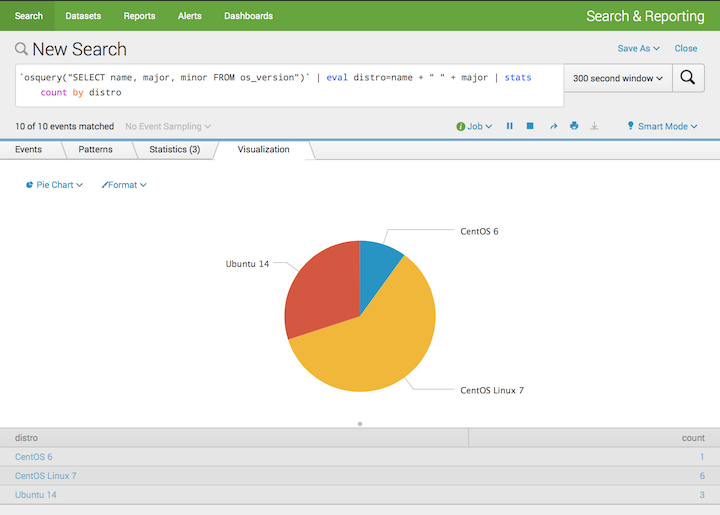
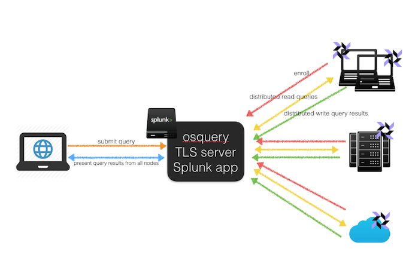
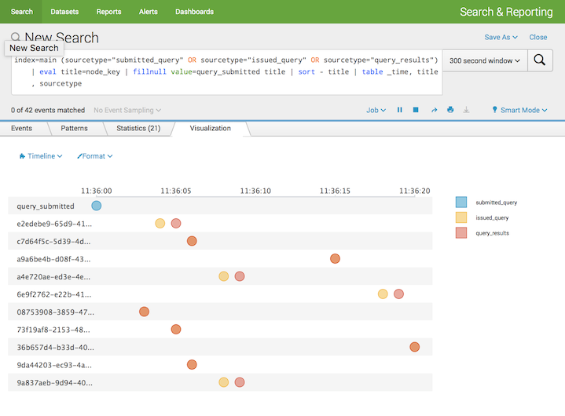

Overview
=====================================
Use [osquery](http://osquery.io/) and [Splunk](http://splunk.com) to query your server infrastructure on the fly. 

This project is a Splunk app that implements an osquery TLS server for [all its remote APIs](https://github.com/facebook/osquery/blob/master/docs/wiki/deployment/remote.md), including:

* enrollment API
* configuration API
* distributed read API
* distributed write API

Users can install this app in Splunk and can submit ad hoc osquery into all osquery clients enrolled and present the data from all enrolled osquery nodes in Splunk.

Sample queries
=====================================
This is a sample osquery that performs an osquery to get OS distros for all nodes. This may be useful when determining which nodes need to be patched.

```
SELECT name, major, minor FROM os_version
```

You can issue an osquery using the `osquery` macro in the Splunk app with some additional SPL commands you want in the search pipleline. For example:

```
`osquery("SELECT name, major, minor FROM os_version")`
| eval distro=name + " " + major
| stats count by distro
```
NOTE: Because the osquery results are written back asynchrounusly from multiple nodes, please submit this query as *a real time Splunk search*, with 300 seconds window for example, so that you can see the results directly after submitting the search. 

If you submit it as a plain Splunk search, you may not see any result because the results are not written back yet, and in that case, you have to issue another Splunk search to query the results later. Currently, the query results are stored in `main` index with `query_results` sourcetype, so you can issue query like `index=main sourcetype="query_results"` and filter the results using your `query_id` field.




There are other sample queries like:

* Get all running processes from all nodes whose binary was removed/replaced during running:

```
SELECT name, path, pid FROM processes WHERE on_disk = 0;
```
* Get all nodes who has users logged in as `root` in last hour:

```
SELECT username, pid, type, time, host 
FROM last 
WHERE username='root' AND time > ((SELECT unix_time FROM time) - 3600)
```

How it works
=====================================



1. Every osquery node enrolls itself with the osquery TLS server Splunk app (<span style="color:red">red</span> lines in the above picture)
2. User submits osquery as a Splunk search in the Splunk app (<span style="color:orange">orange</span> lines)
3. The Splunk app distributes the osquery to all nodes enrolled (<span style="color:yellow">yellow</span> lines)
4. Each osquery node receiving the osquery performs the query locally
5. Each osquery node writes the query results back to the Splunk app once the query finishes (<span style="color:green">green</span> lines)
6. Splunk aggregates the distributed osquery result and presents the result to the user (<span style="color:blue">blue</span> lines)

## Visualizing the osquery execution using timeline
The entire osquery execution flow of steps 2~5 in the above section can be visualized using the timeline visualization.



The above diagram is a multi swimming lane timeline diagram, in the diagram:

* The `query_submitted` swimming lane indicates the time an osquery is submitted
* Each swimming lane with a random ID is an enrolled node with osquery installed
* Each circle on the lane indicates:
	* either the query is retrieved by the node from the Splunk app (the yellow circle)
	* or the query result is written back to Splunk from the node (the red circle)
	* sometimes the query retrieval and query results writing back happens at almost the same time so you will see only one circle on the lane (because the two circles overlapped)

Get it up and running
======================

## Prerequisite
* Install [Docker for Mac](https://docs.docker.com/docker-for-mac/)
* Install [Vagrant](https://www.vagrantup.com)

## Build the project
* Set up a running environment using Vagrant and Docker for Mac
	* `make up`
	* This will create a Docker container running Splunk Enterprise with the `osquery_tls_server_splunk_app` installed
* Create a cluster of containers with osquery installed
	* Build the Docker images, `make build_osquery_client` 
	* Create a Docker swarm cluster, `docker swarm init`
	* Create the Docker containers within the Docker swarm cluster, `docker stack deploy --compose-file docker-stack.yml osqueryd`
	* All containers will enroll into the osquery TLS serer splunk app automatically

You should now be able to access the Splunk enterprise web UI via http://localhost:8000 with admin/changeme as credentials.


Issue osquery to the TLS server
======================

* (Optional) Install Splunk time line app (https://splunkbase.splunk.com/app/3120/) for visualizing the query submission/query reading/query result writing process by using the following query as *a real time Splunk search* (recent 300 seconds):

	```
	index=main (sourcetype="submitted_query" OR sourcetype="issued_query" OR sourcetype="query_results") 
	| eval title=node_key 
	| fillnull value=query_submitted title 
	| sort - title 
	| table _time, title, sourcetype
	```
	
* Submit Splunk search like this in search box:

	``` 
	`osquery("SELECT name, major, minor FROM os_version")` 
	| eval distro=name + " " + major 
	| stats count by distro
	```
	
* One more demo for detecting not on disk process:
	* `docker ps` to find a osquery container id
	* `docker exec -it ${some_osquery_container_id} bash`
	* start a background process in this container, `top &`
	* simulating an intrusion by replacing a running process's binary, `mv /usr/bin/sudo /usr/bin/top`
	* Submit a Splunk search like this to detect this intrusion:
		`` `osquery("SELECT name, pid, path FROM processes WHERE on_disk=0")` ``
	
* For more queries, please consult osquery's [doc](https://osquery.io/docs/tables/)


TLS server remote APIs
==========================
* Enroll API

~~~
curl -X "POST" "https://localhost:8089/services/osquery/enroll" \
     -H "Content-Type: application/json; charset=utf-8" \
     -d $'{
  		"host_identifier": "paw_host",
	    "enroll_secret": "this_is_enroll_secret"
	  }'
~~~

* Config API

~~~
curl -X "POST" "https://localhost:8089/services/osquery/config" \
     -H "Content-Type: application/json; charset=utf-8" \
     -d $'{
  		"host_identifier": "localhost",
  		"enroll_secret": "this_is_enroll_secret"
     }'
~~~

* Logger API

~~~
curl -X "POST" "https://localhost:8089/services/osquery/logger" \
     -H "Content-Type: application/json; charset=utf-8" \
     -d $'{
  		"data": "",
  		"log_type": "status",
  		"node_key": "test_node_key"
	  }'
~~~

* Distributed read API

~~~
curl -X "POST" "https://localhost:8089/services/osquery/distributed_read" \
     -H "Content-Type: application/json; charset=utf-8" \
     -d $'{
  		"node_key": "test_node_key"
	  }'
~~~

* Distributed write API

~~~
curl -X "POST" "https://localhost:8089/services/osquery/distributed_write" \
     -H "Content-Type: application/json; charset=utf-8" \
     -d $'{
  		"node_key": "test_node_key"
	  }'
~~~

Troubleshooting
=================
* Find all the enrolled nodes

```
index=main sourcetype="enrollment" 
| fields event.node_key, _time
| table * 
```

* Retrieve submitted ad hoc osqueries

```
index=main sourcetype=submitted_query 
| fields query_id, query, _time 
| table *
```

* TLS server API logging messages will be stored in var/log/splunk/python.log, and can be searched like:
```
index=_internal sourcetype="splunk_python" action="pending_queries_retrieved"
```

* Find all queries issued to nodes 
```
index=main sourcetype="issued_query"
```

* Find queries results written back from nodes
```
index=_internal action="distributed_write_query_results"
```

* Search to see if there is any failed query
```
index=_internal sourcetype=failed_queries
```

* `docker logs ${osquery_container_id}` to see if there is any "Executing distributed query" in osquery client stdout indicating the distributed query is really performed locally

TODO
=========
* Some of the app configurations, such as the target index used for storing data and the credentials used to talk to Splunk/HEC are hard coded in package/bin/app_config.py, and should be externalized into some configuration file later.
* No authentication is required for consuming the remote API for enrolled nodes, some additional authentication, like TLS client certificate authentication will be needed in production deployment
* So far, the osquery will be sent to all enrolled nodes, which may not be desireable in some case, this could be improved by introducing more functionalities when distributing the queries.